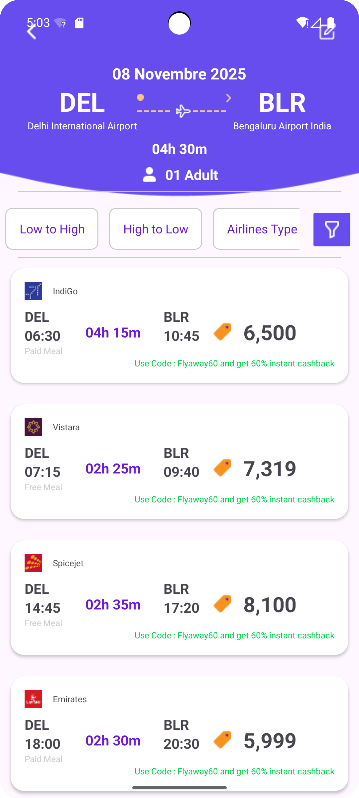
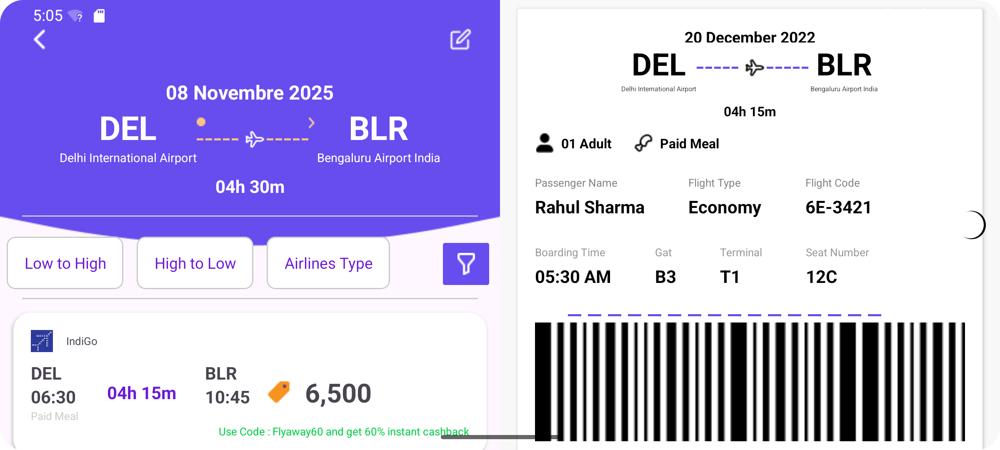
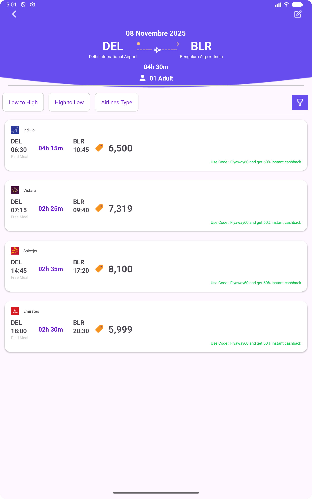
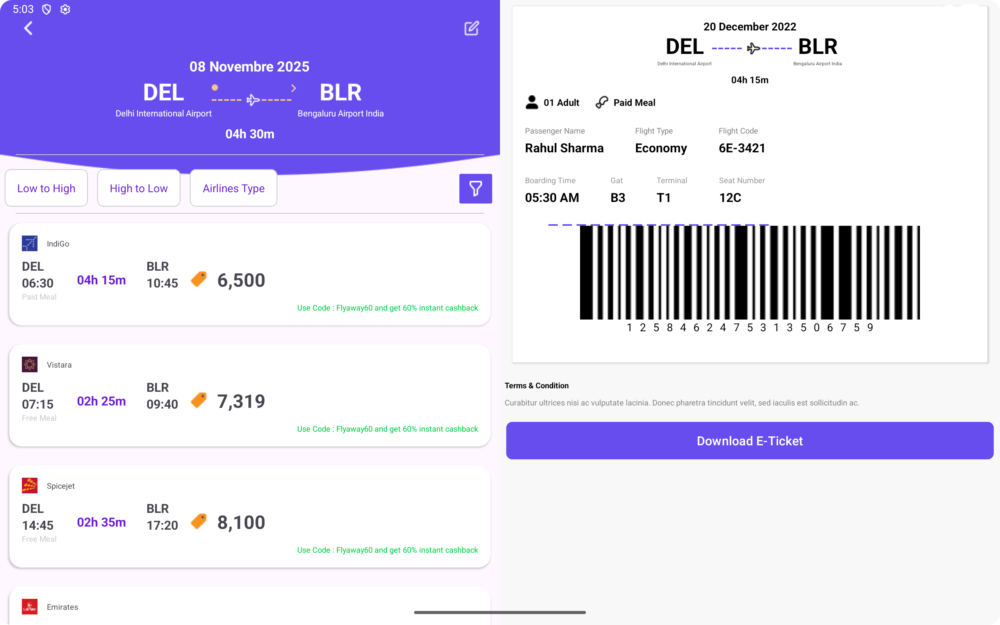

# Mon Projet d'Application (Nom à changer)

Ceci est un simple projet Android pour [**Décrivez brièvement votre projet ici, par exemple : "une interface de réservation de billets d'avion"**].

## 📱 Aperçus

Le projet gère les orientations portrait et paysage pour les téléphones et les tablettes.

<table>
  <tr>
    <td align="center"><b>Téléphone (Portrait)</b></td>
    <td align="center"><b>Téléphone (Paysage)</b></td>
  </tr>
  <tr>
    <td></td>
    <td></td>
  </tr>
  <tr>
    <td align="center"><b>Tablette (Portrait)</b></td>
    <td align="center"><b>Tablette (Paysage)</b></td>
  </tr>
  <tr>
    <td></td>
    <td></td>
  </tr>
</table>

## 🛠️ Technologies utilisées

* Kotlin
* XML Layouts
* Android SDK

## 🚀 Lancer le projet

1.  Clonez ce dépôt.
2.  Ouvrez le projet avec Android Studio.
3.  Lancez la compilation (Build > Make Project).
4.  Exécutez l'application sur un émulateur ou un appareil physique.